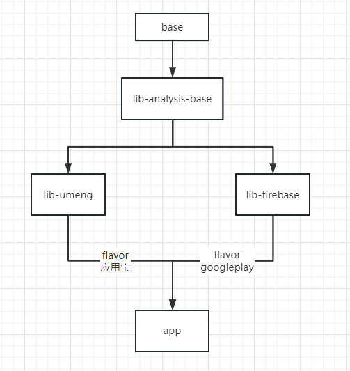

## 需求: 根据不同的渠道flavor，使用不同的统计sdk：例如国内渠道用 umeng 统计，国外的 google play 用 firebase


## 最简单的实现:
```
if(google play 渠道){
   初始化firebase sdk;
}else {
   初始化umeng sdk;
}
```
缺点是: 同时引入了两个sdk，虽然可以通过 proguard 去掉未被使用的sdk，但是不太优雅。

## 本demo的实现: 为不同flavor添加不同依赖 + 自定义ContentProvider"注入"实现类
步骤一：为不同flavor添加不同依赖
```
    //当flavor是googleplay时, 引入 firebase
    googleplayImplementation project(path: ':analysis:lib-firebase')
    //当flavor是market_yingyongbao时, 引入 umeng
    market_yingyongbaoImplementation project(path: ':analysis:lib-umeng')
```
步骤二：自定义ContentProvider 填充实现
```
//当引入的是 analysis:lib-firebase 这个module时, MyProviderForFirebase 会被初始化:
class MyProviderForFirebase: ContentProvider() {
    private val TAG = "MyProviderForFirebase"
    override fun onCreate(): Boolean {
        AnalysisUtils.instance =  FirebaseUtils() //给AnalysisUtils.instance赋值, 填充实现类
        return true
    }
    ...
}
```

```
//当引入的是 analysis:lib-umeng 这个module时, MyProviderForUmeng 会被初始化:
class MyProviderForUmeng: ContentProvider() {
    private val TAG = "MyProviderForUmeng"
    override fun onCreate(): Boolean {
        AnalysisUtils.instance = UmengUtils() //给AnalysisUtils.instance赋值, 填充实现类
        return true
    }
    ...
}
```
使用:
```
class MainActivity : AppCompatActivity() {

    override fun onCreate(savedInstanceState: Bundle?) {
        super.onCreate(savedInstanceState)
        setContentView(R.layout.activity_main)
        
        AnalysisUtils.instance?.init(this)
        AnalysisUtils.instance?.onEvent(EventType.xxxxx)
        ...
    }
}
```

缺点: 
- AnalysisUtils.instance 这个变量是全局的，也不是非常优雅，而且它的 set 方法是公开的。
- 引入了自定义ContentProvider，可能影响性能。解决方案：引入App Startup：https://juejin.cn/post/6844904190440013837

项目的module结构:



## 参考链接
[Configure build variants: dependencies](https://developer.android.com/build/build-variants#dependencies)
[使用ContentProvider初始化三方库](https://juejin.cn/post/6844903890513575943)

